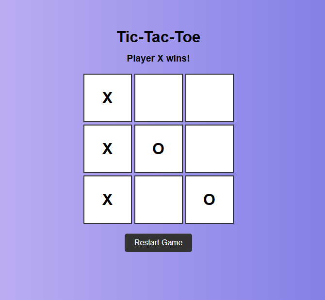

# Vanilla JS Tic-Tac-Toe

A simple Tic-Tac-Toe game built using HTML, CSS, and Vanilla JavaScript.

## Features

- Two-player Tic-Tac-Toe game
- Player X and Player O turns
- Win detection
- Draw detection
- Restart game button
- Responsive design for different screen sizes

## Technologies Used

- HTML5
- CSS3
- JavaScript (Vanilla JS)

## Project Structure

```
vanilla-js-tic-tac-toe/
│
├── index.html
├── style.css
├── script.js
├── README.md
└── screenshot.png
```

## How to Run

1. Clone the repository:

```bash
git clone https://github.com/Areej39/vanilla-js-tic-tac-toe
```

2. Open the project folder:

```bash
cd vanilla-js-tic-tac-toe
```

3. Open `index.html` in your browser.

## Screenshot



## Game Instructions

- Player X starts the game.
- Click on any empty box to place your mark.
- Players take turns.
- The first player to get three marks in a row wins.
- Press the Restart Game button to play again.

## Author

Areej39
